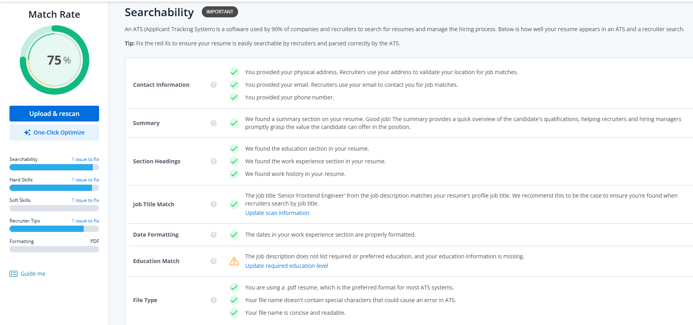

# Devsync Default Template


A modern, multilingual portfolio template powered by the Devsync ecosystem.

## Quick Start

Initialize your project with a single command:

```bash
bunx @jannael/devsync init
```

## Configuration

Visit [devsync.work](https://devsync.work) to configure your profile and generate your `DEVSYNC.json`.

## Color Palette

Customize the theme by editing `src/styles/global.css`. The template uses Tailwind 4's `@theme` directive for light mode and a `.dark` class override for dark mode.

```css
@theme {
	--color-main: #ffffff;
	--color-text: #1a1a1a;
	--color-text-secondary: #6b7280;
	--color-accent: #338e5e;
	--color-accent-light: #e6f4ec;
	--color-border: #e5e7eb;
}

.dark {
	--color-main: #0f0f0f;
	--color-text: #f5f5f5;
	--color-text-secondary: #9ca3af;
	--color-accent: #4ade80;
	--color-accent-light: #1a2e22;
	--color-border: #2a2a2a;
}
```

| Variable                 | Light default | Dark default | Usage                     |
| ------------------------ | ------------- | ------------ | ------------------------- |
| `--color-main`           | `#ffffff`     | `#0f0f0f`    | Page background           |
| `--color-text`           | `#1a1a1a`     | `#f5f5f5`    | Primary text color        |
| `--color-text-secondary` | `#6b7280`     | `#9ca3af`    | Muted/secondary text      |
| `--color-accent`         | `#338e5e`     | `#4ade80`    | Accent highlights, links  |
| `--color-accent-light`   | `#e6f4ec`     | `#1a2e22`    | Subtle accent backgrounds |
| `--color-border`         | `#e5e7eb`     | `#2a2a2a`    | Card borders, dividers    |

These variables are available in any HTML element via `var(--color-*)`, so you can also use them in custom styles beyond Tailwind utilities.

## Available Icons

| Icon     | Import path          |
| -------- | -------------------- |
| CV       | `/icon/cv.svg`       |
| Devsync  | `/icon/devsync.svg`  |
| Facebook | `/icon/facebook.svg` |
| GitHub   | `/icon/github.svg`   |
| Gmail    | `/icon/gmail.svg`    |
| LinkedIn | `/icon/linkedin.svg` |
| Moon     | `/icon/moon.svg`     |
| Sun      | `/icon/sun.svg`      |
| X        | `/icon/x.svg`        |

## ATS Benchmark



ATS compatibility test performed on [Jobscan](https://www.jobscan.co/) using data from `preview-DEVSYNC.json` against the following job description:

> **Senior Frontend Engineer - Developer Tools**
>
> **Location:** Remote | **Type:** Full-time
>
> **About the role:**
> We are looking for a Senior Frontend Engineer to join our Developer Tools team. You will build and maintain CLI tools, web templates, and automation pipelines that help developers ship faster.
>
> **Requirements:**
>
> - 3+ years of experience in TypeScript and Node.js development
> - Strong experience with Astro, React, and Tailwind CSS
> - Experience building and maintaining open-source CLI tools published to npm
> - Experience with Zod or similar schema validation libraries
> - Experience with GitHub Actions or CI/CD pipelines
> - Bilingual English / Spanish
>
> **Nice to have:**
>
> - Experience with Bun runtime
> - Experience with PostgreSQL
> - Active open-source portfolio or personal projects
>
> **Key responsibilities:**
>
> - Design and maintain CLI scaffolding tools
> - Build responsive multilingual web templates
> - Implement automated CI pipelines for artifact generation
> - Write documentation and onboarding guides
