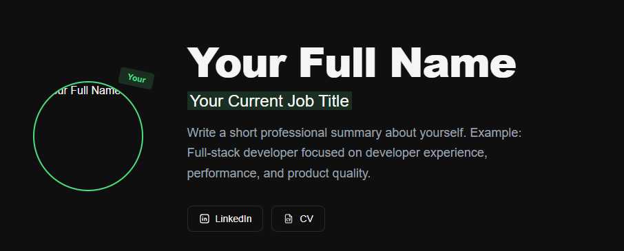

# Devsync Default Template




A modern, multilingual portfolio template powered by the Devsync ecosystem.

## Quick Start

Initialize your project with a single command:

```bash
bunx @jannael/devsync init
```

## Configuration

Visit [devsync.work](https://devsync.work) to configure your profile and generate your `DEVSYNC.json`.

## Available Icons

| Icon     | Import path          |
| -------- | -------------------- |
| CV       | `/icon/cv.svg`       |
| Devsync  | `/icon/devsync.svg`  |
| Facebook | `/icon/facebook.svg` |
| GitHub   | `/icon/github.svg`   |
| Gmail    | `/icon/gmail.svg`    |
| LinkedIn | `/icon/linkedin.svg` |
| Moon     | `/icon/moon.svg`     |
| Sun      | `/icon/sun.svg`      |
| X        | `/icon/x.svg`        |
